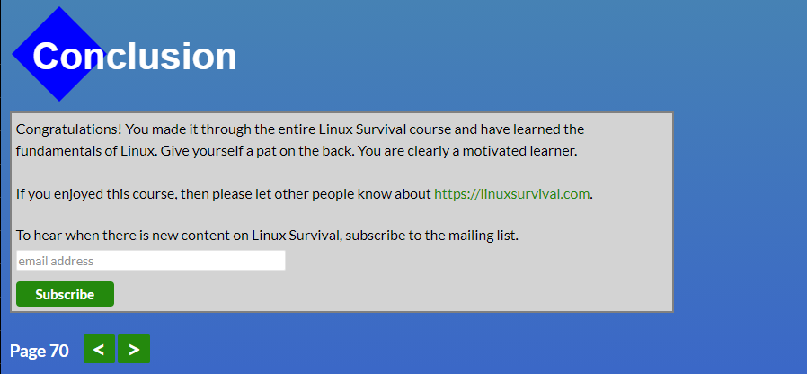
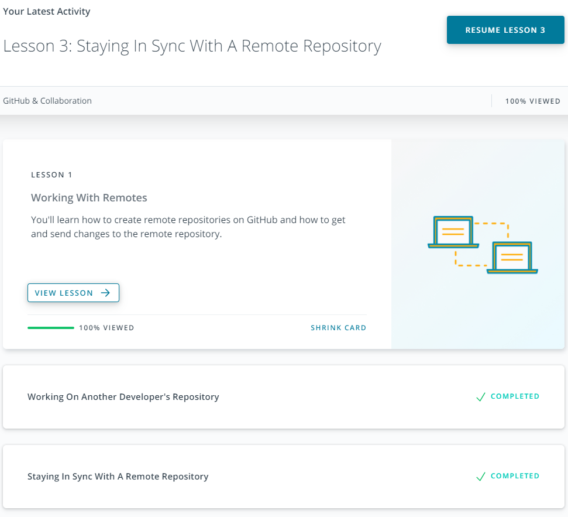
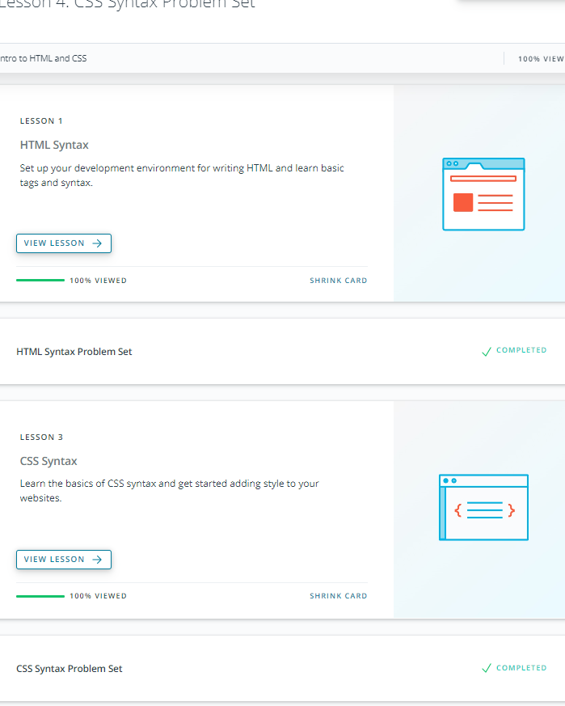
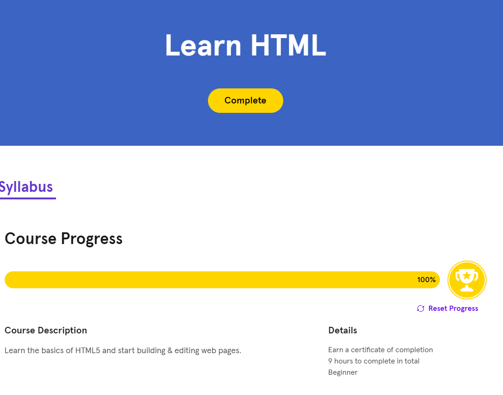
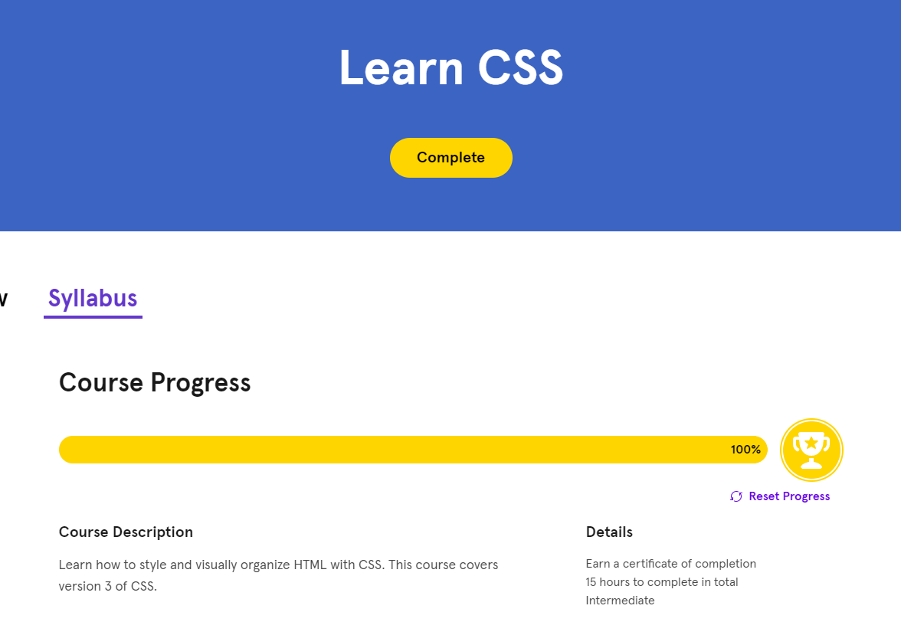

# kottans-frontend course
------------
## General
------------
### 0. Git Basic

Git gives  the opportunity not to be afraid, to make mistakes.

### 1. Linux CLI and Networking
- Linux
    - It was quite interesting to use the terminal, it is faster and more efficient.
    Easy to manage file system. The new one, it's acces to memory in Linux compared 
    to Windows, more features
    
- Networking
    - Complex material, a lot of information. It's not yet clear how we will use it.
    It was interesting to discover the structure of the url, how there is an exchange
    between users and servers. Now numbers like 404 have more meaning. :D

### 2. VCS (hello gitty), GitHub and Collaboration
- GitHub
    - I discovered many interface options and new commands. How to properly and according 
    to their rules cooperate with other developers. How to work with issues and use pull 
    requests correctly.
    

------------
## Front-End Basics
------------
### 3. Intro to HTML & CSS
- HTML/CSS
    - In this part of the course, the discovery for me was CSS GRID, a cool technology that allows you to adapt and flexibly adjust the page layout. 
    Also CSS TRANSITIONNow I understand how animations work and run!

    
    ---
    
    ---
    

### 4. Responsive Web Design